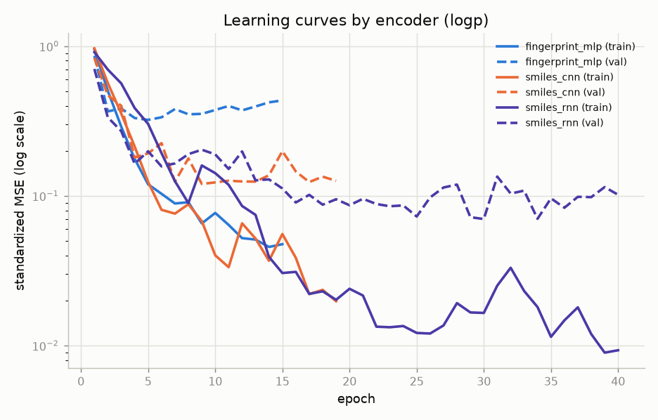
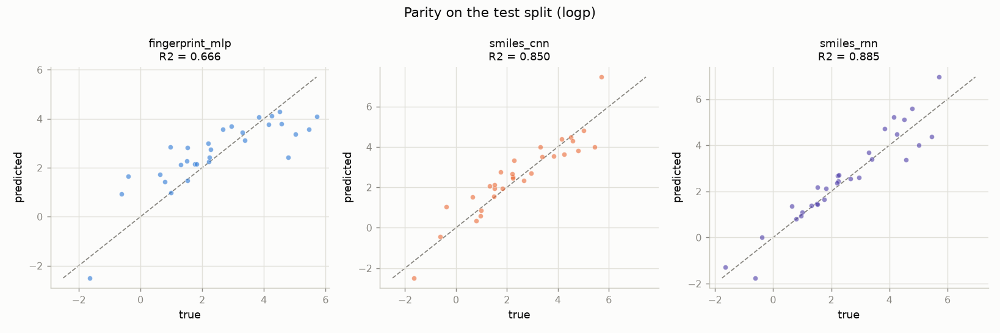

# molecular-property-prediction

A small PyTorch library for comparing molecular representations on a regression
target. Three interchangeable encoders, a shared trainer with early stopping, and
a pluggable interface so you can drop in your own encoder and benchmark it against
the built-in three with no other code changes.

```python
from molprop import load_sample, random_split, build_encoder, Trainer, set_seed

set_seed(0)
dataset = load_sample(target="logp")            # packaged sample, no network
train_set, val_set, test_set = random_split(dataset)

model = build_encoder("smiles_rnn", vocab_size=len(dataset.tokenizer), n_bits=1024)
trainer = Trainer(model, patience=10).fit(train_set, val_set, epochs=60, verbose=False)
print(trainer.evaluate(test_set))               # {'rmse': ..., 'mae': ..., 'r2': ...}
```

The regression target is an RDKit descriptor (logP, TPSA, or molecular weight)
computed directly from structure, so every benchmark is reproducible from SMILES
alone with no dataset license to manage.

## Install

```bash
python -m venv .venv && source .venv/bin/activate   # Windows: .venv\Scripts\activate
pip install torch --index-url https://download.pytorch.org/whl/cpu
pip install -e ".[dev]"
```

## API reference

The full reference lives in [docs/usage.md](docs/usage.md). The surface in brief:

**Data**

- `load_sample(target="logp", n_bits=1024)` returns a `PropertyDataset` over the
  committed sample of a few hundred public SMILES. Fully offline.
- `build_dataset(smiles, target="logp", n_bits=1024)` builds a dataset from any
  SMILES list; invalid SMILES are skipped.
- `load_smiles_csv(path)` reads a SMILES column from a CSV.
- `random_split(dataset, fractions=(0.8, 0.1, 0.1), seed=0)` returns train, val,
  and test splits that share the training tokenizer.

**Encoders**

- `available_encoders()` lists the registered names:
  `fingerprint_mlp`, `smiles_cnn`, `smiles_rnn`.
- `build_encoder(name, *, vocab_size, n_bits, **kwargs)` instantiates one.
- Every encoder is a `MolEncoder`: an `nn.Module` whose `forward(batch)` returns a
  tensor of shape `(batch_size,)`.

**Training**

- `Trainer(model, lr=1e-3, weight_decay=0.0, patience=0)` standardizes the target,
  optimizes MSE with Adam, and de-standardizes predictions.
- `trainer.fit(train_set, val_set, epochs, batch_size)` records `history`,
  `best_epoch`, and `stopped_epoch`. Passing `patience > 0` enables early stopping
  and restores the best-scoring weights.
- `trainer.predict(dataset)` and `trainer.evaluate(dataset)` (RMSE, MAE, R^2).

## Extend it: add your own encoder

Subclass `MolEncoder`, implement `forward` and `from_dataset_spec`, and register
it. It is then reachable by name and trains through the same `Trainer`.

```python
import torch, torch.nn as nn
from molprop import MolEncoder, register_encoder, build_encoder
from molprop.data import Batch


@register_encoder("mean_embed")
class MeanEmbedEncoder(MolEncoder):
    def __init__(self, vocab_size: int, embed_dim: int = 64) -> None:
        super().__init__()
        self.embed = nn.Embedding(vocab_size, embed_dim, padding_idx=0)
        self.head = nn.Linear(embed_dim, 1)

    @classmethod
    def from_dataset_spec(cls, *, vocab_size, n_bits, embed_dim=64, **kwargs):
        return cls(vocab_size=vocab_size, embed_dim=embed_dim)

    def forward(self, batch: Batch) -> torch.Tensor:
        mask = (batch.ids != 0).unsqueeze(-1).float()
        pooled = (self.embed(batch.ids) * mask).sum(1) / mask.sum(1).clamp(min=1.0)
        return self.head(pooled).squeeze(-1)
```

A runnable version is in [examples/custom_encoder.py](examples/custom_encoder.py).

## Learning curves

Train (solid) and validation (dashed) loss for all three encoders on one axis,
standardized MSE on a log scale. Curves end at different epochs because each
encoder early-stops on its own validation RMSE.



Per-encoder parity on the held-out test split:



## Results

Target logP, RDKit-computed, random 80/10/10 split, seed 0, 60 epochs, single
CPU. Every number below was produced by `scripts/benchmark.py` on the committed
sample in this repository and is written to
[results/metrics.json](results/metrics.json).

**Committed sample (300 public SMILES, the offline quickstart):**

| Encoder | RMSE | MAE | R^2 |
|---------|-----:|----:|----:|
| smiles_rnn | 0.6196 | 0.4732 | 0.8848 |
| smiles_cnn | 0.7073 | 0.5525 | 0.8499 |
| fingerprint_mlp | 1.0545 | 0.8183 | 0.6665 |

The sequence models learn the near-additive structure of logP from raw SMILES and
beat the fixed fingerprint baseline, with the LSTM ahead of the CNN. The ranking
depends on the target; try `--target tpsa` to see it shift. See
[model_card.md](model_card.md) for the encoders, data, and intended use.

To scale up, download a larger public SMILES set and pass it to the same script.
The target stays RDKit-computed, so no measured-property license is involved:

```bash
python scripts/benchmark.py --target logp --epochs 60           # offline, sample
python scripts/download_data.py --out data/smiles.csv           # fetch full set
python scripts/benchmark.py --csv data/smiles.csv --target logp # full set
```

## Layout

```
src/molprop/       tokenizer, featurize, data, models (encoders + registry), train
  sample_smiles.csv  packaged sample used by load_sample
examples/          quickstart.py, custom_encoder.py, compare_encoders.py
scripts/           benchmark.py, download_data.py
docs/              usage.md (API reference)
notebooks/         demo.ipynb (executed)
tests/             pytest suite for the API, tokenizer, data, and models
results/           learning_curves.png, parity.png, metrics.json
data/              sample_smiles.csv committed; full downloads gitignored
model_card.md      encoders, data, intended use, limitations
```

## Tests

```bash
pytest -q
ruff check src tests scripts examples
```

## License

MIT, see [LICENSE](LICENSE).

## Author

Aamir Malik. [GitHub](https://github.com/aamirmalik-dr) ·
[LinkedIn](https://linkedin.com/in/dr-aamirmalik)

---

*Refactored and engineered into this tested, reproducible project in July 2026, from work originally done for the AI Chemistry course at KAIST (Fall 2022).*
